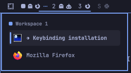

# Workspaces Preview

An [Omarchy](https://omarchy.org/) shell plugin that replaces the built-in
workspace indicator with one that lets you preview and pick a window before
switching, instead of jumping blind into a busy workspace.



## Why

Omarchy's built-in `omarchy.workspaces` widget switches straight to a
workspace on click. That's fine when a workspace has one window, but on a
busy workspace you land wherever the compositor last left focus, then have
to hunt for the window you actually wanted. This plugin adds a picker: click
(or press `SUPER+<number>`) on a workspace with more than one window and a
popup lists its windows so you can jump straight to the right one.

## Install

```
omarchy plugin add https://github.com/eddygarcas/omarchy-workspaces-preview.git --enable
```

Or manually:

```
git clone https://github.com/eddygarcas/omarchy-workspaces-preview.git \
  ~/.config/omarchy/plugins/eduard.workspaces
omarchy-shell shell rescanPlugins
omarchy plugin enable eduard.workspaces
```

Installing switches the bar to this widget in place of the built-in
`omarchy.workspaces`.

### Optional: wire up SUPER+<number>

By default `SUPER+<number>` still runs Hyprland's plain
`hl.dsp.focus` and switches immediately. To make it defer to this widget's
picker on busy workspaces, run:

```
~/.config/omarchy/plugins/eduard.workspaces/scripts/install-keybinding.sh
```

This appends a marked, idempotent block to `~/.config/hypr/bindings.lua`
(backing it up first) and Hyprland picks it up automatically on save. To
revert it later: `scripts/uninstall-keybinding.sh`.

Prefer to do it by hand instead? Add this to `~/.config/hypr/bindings.lua`:

```lua
local workspace_picker = os.getenv("HOME") .. "/.config/omarchy/plugins/eduard.workspaces/scripts/switch-or-preview.sh"
for workspace = 1, 10 do
  local key = "code:" .. tostring(workspace + 9)
  hl.unbind("SUPER + " .. key)
  o.bind("SUPER + " .. key, "Switch to workspace " .. workspace, workspace_picker .. " " .. tostring(workspace))
end
```

Either way, this is a Hyprland keybinding change, not something the plugin
installer runs on its own — Omarchy's plugin manager deliberately never runs
plugin code or install hooks on add/update/enable, so it's opt-in and won't
touch your existing bindings otherwise.

## What it does

- **Click a workspace** — switches directly if it has 0-1 windows. If it has
  more, opens a popup listing its windows instead of switching blind.
- **Pick a window from the popup** — arrow keys (or mouse hover) to move the
  selection, `Enter`/click to jump to it. The popup auto-dismisses after 2
  seconds of inactivity, or on `Esc`.
- **`SUPER+<number>`** (once wired up per above) — same behavior as a click,
  via `scripts/switch-or-preview.sh` and an `IpcHandler` (`eduard.workspaces
  preview <id>`) that relays the request to whichever monitor is currently
  focused.
- Workspace `10` displays as `0`, matching the built-in widget.

## Multi-monitor workspace linking

On a setup with exactly two monitors, workspaces pair up automatically:
`1`+`2`, `3`+`4`, `5`+`6`, and so on. Switching to either member of a pair
shows both at once — the odd id lands on your leftmost monitor (by
position), the even id on the other — instead of the switch stealing the
workspace from whichever monitor already had it.


*Workspace `3` just got selected — its pair partner, `4`, comes along on
the other monitor. The dotted line marks the pair; `1`+`2` are linked too,
just not the active pair right now.*

The bar reflects the pairing: a dotted line connects a linked pair, and a
workspace that's only on-screen because its pair partner was selected
still shows at full brightness instead of reading as empty/unfocused.

This applies to both `SUPER+<number>` and clicking a workspace in the bar.
Setups with one monitor, or three or more, are unaffected — each workspace
switches on its own, same as the built-in widget.

## Known limitations

The `SUPER+<number>` integration requires running `scripts/install-keybinding.sh`
(or editing `~/.config/hypr/bindings.lua` by hand, see above) — a plugin can't
safely rewrite another config file's keybindings for you, so this step isn't
automated by install/enable.

## Permissions & dependencies

- No external packages or network access required.
- Reads workspace/window state via Quickshell's `Hyprland` integration and
  switches via `scripts/focus-workspace.sh`.
- `scripts/focus-workspace.sh` calls `hyprctl monitors -j`, `jq`, and
  `hyprctl dispatch hl.dsp.focus(...)` to switch — and, only on an
  exactly-two-monitor setup, a few extra `hl.dsp.focus({monitor=...})`
  dispatches to link a workspace pair across both monitors (see above).
- `scripts/switch-or-preview.sh` (only used if you wire up the optional
  keybinding) calls `hyprctl workspaces -j`, `jq`, `omarchy-shell`, and
  `scripts/focus-workspace.sh` for the actual switch.
- `scripts/install-keybinding.sh` / `scripts/uninstall-keybinding.sh` only
  ever touch `~/.config/hypr/bindings.lua`, and back it up before editing it.
- Like every Quickshell plugin, this code runs unsandboxed inside the shared
  `omarchy-shell` process — review `Workspaces.qml` before installing.

## Files

| File                                 | Purpose                                             |
|---------------------------------------|------------------------------------------------------|
| `manifest.json`                       | Plugin manifest (`bar-widget`)                        |
| `Workspaces.qml`                      | Bar widget, popup UI, and IPC handler                 |
| `scripts/focus-workspace.sh`          | Switches workspaces; links odd/even pairs on 2 monitors |
| `scripts/switch-or-preview.sh`        | Optional `SUPER+<number>` keybinding helper           |
| `scripts/install-keybinding.sh`       | Wires up the optional keybinding (see above)          |
| `scripts/uninstall-keybinding.sh`     | Reverts `install-keybinding.sh`                       |

## Remove

```
omarchy plugin remove eduard.workspaces
```

This deletes `~/.config/omarchy/plugins/eduard.workspaces/` and restores the
built-in `omarchy.workspaces` widget on the bar. If you wired up the optional
keybinding, revert that block in `~/.config/hypr/bindings.lua` by hand.

## License

MIT — see [LICENSE](LICENSE).
